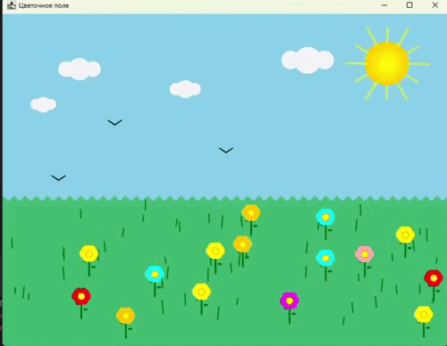

# FlowerField
2D-анимация цветочного поля с интерактивными элементами. В данной анимации вы можете:
1) Добавить цветок со случайным цветом лепестков с помощью ЛКМ (только в пределах поля с травой)
2) Добавить птицу с помощью ЛКМ (только в пределах неба)
3) Перетащить цветок в любую часть поля с помощью ЛКМ
4) Удалить любой цветок с поля с помощью ПКМ

  
   
  <em>Демонстрация работы программы</em>

